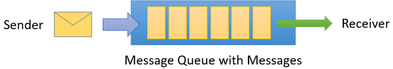
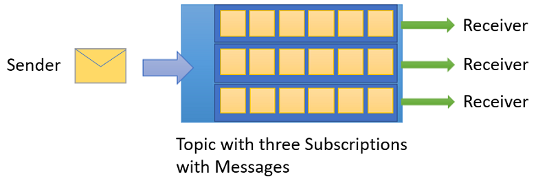

# Azure Container Apps Jobs

This repository explores the Azure Container Apps Jobs capabilities:

Scenario(s):

- [Queue based point-to-point communication](https://learn.microsoft.com/en-us/azure/container-apps/tutorial-event-driven-jobs?source=recommendations)
  with
    - Azure Storage Queue
    - Azure Service Bus Queue

## Objectives and Content Overview

TODO: Overview Image

- Dockerfile to create a service that processes messages ([Dockerfile](Dockerfile))
    - Multistage Dockerfile for production and development
    - Can be executed locally by mounting the azure credentials (see [Makefile](Makefile))
- Example code to write messages to a **storage queue** ([storage_queue_process.py](storage_queue_process.py))
- Example code to process messages in a **storage queue** ([storage_queue_write.py](storage_queue_write.py))
    - messages are in JSON format
    - messages can be transformed into pydantic models
    - messages are written to a poison queue
    - messages check the dequeue count
    - messages that are received are not visible for a period of time, therefore can't be processed by other services
- Example code to write messages to a **service bus queue** ([service_bus_write.py](service_bus_write.py))
- Example code to process messages in a **service bus queue** ([service_bus_process.py](service_bus_process.py))
- Execute a job & get the job execution status using REST API/Python SDK ([start_job.py](start_job.py))
- Show that a User Assigned Managed Identity (instead of access keys) is used to
    - pull the image from the container registry
    - process messages in a storage queue or service bus queue

## Provisioning Steps

### Resources

- Create User Assigned Managed Identity (UAMI)
- Create Container Registry
  - Add AcrPull permission (RBAC) to UAMI
- Create Storage Account
    - Create Queue
    - Create Queue (Poison)
- Create Service Bus Namespace
    - Create Queue
- Create Container Apps Environment
- Create Container Apps Jobs
    - Assign UAMI
- Create a job

### Permissions:

- Assign UAMI AcrPull permission
- Assign UAMI Storage Queue Data Contributor (TODO: Storage Queue Data Message Processor should be
  enough? [Principle of Least Privilege](https://learn.microsoft.com/en-us/entra/identity-platform/secure-least-privileged-access))
- Assign UAMI Service Bus Data Owner (
  TODO: [Principle of Least Privilege](https://learn.microsoft.com/en-us/entra/identity-platform/secure-least-privileged-access),
  see [Rights required for Service Bus operations](https://learn.microsoft.com/en-us/azure/service-bus-messaging/service-bus-sas#rights-required-for-service-bus-operations))

## Notes, Insights & TODOs

- When using an UAMI, don't forget to add AZURE_CLIENT_ID as environment variable in the container
- A [KEDA](https://keda.sh/) scaler evaluates scaling rules on a polling interval. A scaling rule for example would be
  checking an event source for messages (e.g. a queue). The scaling rule determines the number of replicas and runs them
  to meet demand.
  It is important to note that if you provision a functionally broken image that doesn't receive any messages (even
  though they exist), the scaling rule will execute a job for this message in every polling interval, creating an
  endless loop.
  Therefore, you should make sure that receiving messages is always possible. Additionally, you should make sure to use
  dead-lettering. Azure storage queue requires us to write the logic (application-level dead-lettering), e.g. add a
  poison queue, work with dequeue
  count and set the visibility parameter in the azure storage queue etc., while Azure service bus has system-provided
  dead-lettering.
- [Queues vs Topics](https://medium.com/@emer.kurbegovic/queues-vs-topics-a-simple-guide-with-real-world-examples-1d32947cb574):
    - **Queue**: single receiver ([FIFO](https://en.wikipedia.org/wiki/FIFO_(computing_and_electronics)))
      
    - **Topic**: many receivers (No [FIFO](https://en.wikipedia.org/wiki/FIFO_(computing_and_electronics)))
      
- ServiceBus Queue has system-provided dead-lettering & uses
  the [AMQP Protocol](https://d0znpp.medium.com/what-is-amqp-protocol-all-you-need-to-know-c9eedb680c71)
- Storage Queue has application-level dead-lettering

- [ ] Try service bus
- [ ] Add KEDA rules here
- [ ] Unit tests?
- [ ] src directory

## Resources

- https://learn.microsoft.com/en-us/azure/container-apps/jobs?tabs=azure-portal
- https://github.com/Azure/azure-sdk-for-python/tree/main/sdk/servicebus/azure-servicebus/samples
- https://www.nickthecloudguy.com/azure-event-driven-blobs-event-grid/
